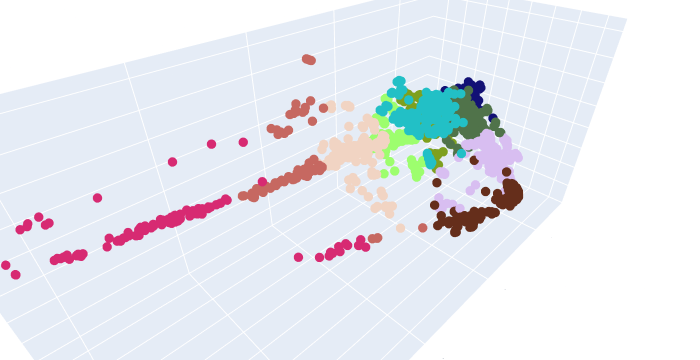

## Telecommunications Data Mining

#### Goal: detect and analyze signal interference patterns in telecommunication coverage area; help telecommunication companies optimize the layout and topology of base transceiver station to reduce signal interference and enhance quality of service.

#### This repo provides AI-based clustering solutions and data analysis methods for detecting, distinguishing and analyzing signal interference patterns. Signal interference data is mapped into a multi-dimensional space, and clustering algorithms are applied to separate and visualize the patterns with distinct color coding.

#### [View Code (TelecomDataMining.ipynb)](TelecomDataMining.ipynb) for the detailed methods.

#### Selected result is shown below

